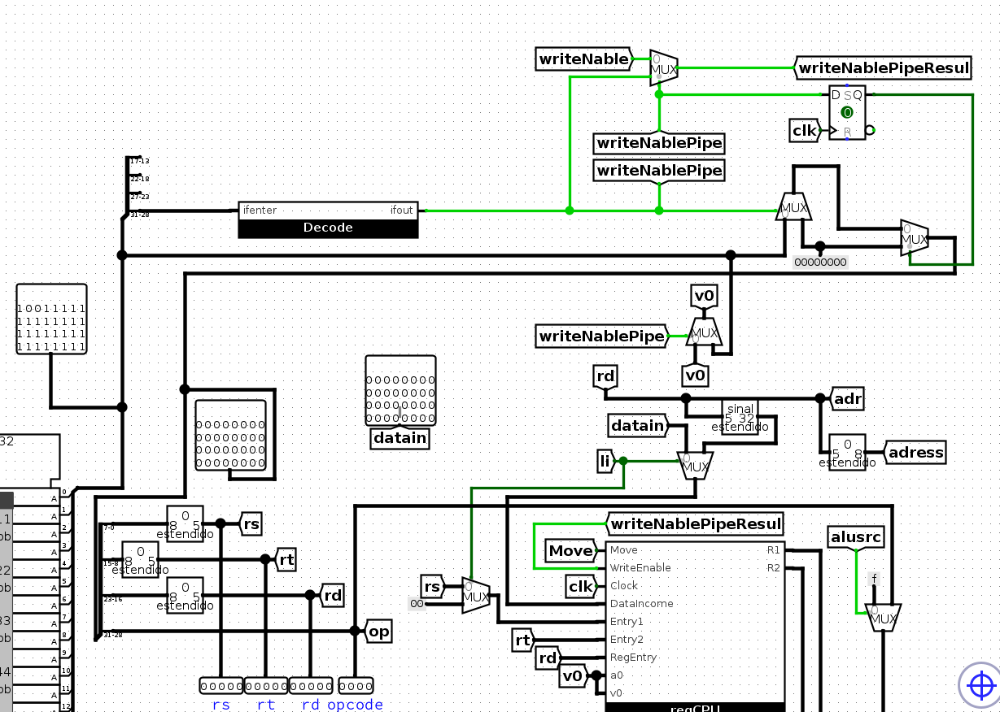
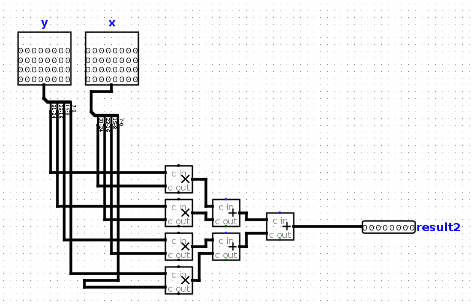

# Zazu MIPS-like processor
## ENTREGA TRABALHO DE ARQUITETURA E ORGANIZAÇÃO DE COMPUTADORES
Trabalho realizado por Thiago Nerton.
Este README fornece informações sobre a atribuição, como configurar e executar o projeto, e detalhes adicionais.

## Sumário
- [Main](#main)
- [ULA](#ULA)
- [RegCPU](#RegCPU)
- [UC](#UC)
- [Etc](#etc)
- [Contribuições](#contribuições)
- [Licença](#licença)

### Main

### ULA

### UC

### Utilização

Projeto requer Logisim Evolution para ser executado.

### Contribuições

Thiago 100%
### Etc
#### Ordem de Leitura
 - RT entry 1
 - RS entry 2
 - RD dest 
 - opcode
   V0 = Reg$3
   Escreve Um - Lê Dois
   Ordem    
   OP RD RT RS
   Manipulação de Endereço sempre por RD
#### OPCODES
  - 0000 : sll
  - 0001 : slr
  - 0010 : MUL
  - 0011 : ADD
  - 0100 : SUB
  - 0101 : AND
  - 0110 : OR
  - 0111 : XOR
  - 1000 : LES
  - 1001 : Li Turbo
  - 1010 : JMP
  - 1011 : MOVE 
  - 1100 : MulMatrix4x4
  - 1101 : LI
  - 1110 : SW
  - 1111 : LW

