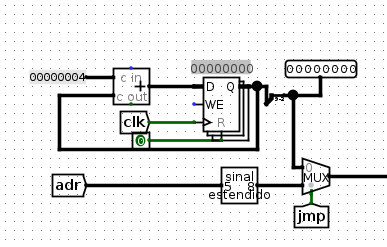
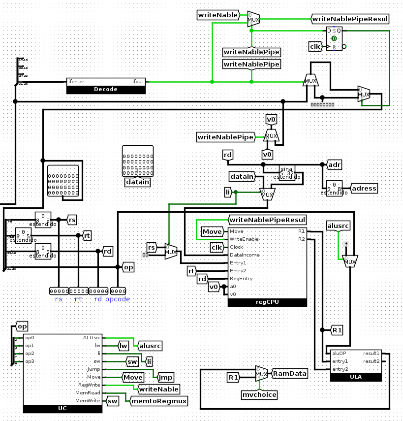
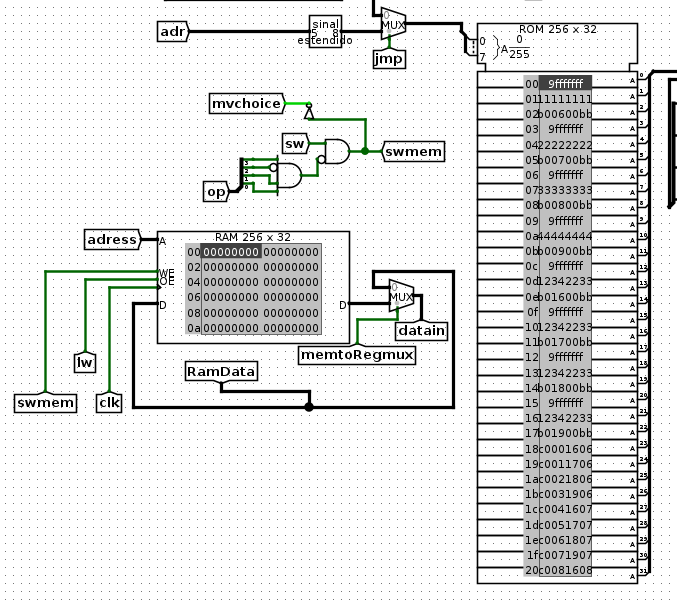
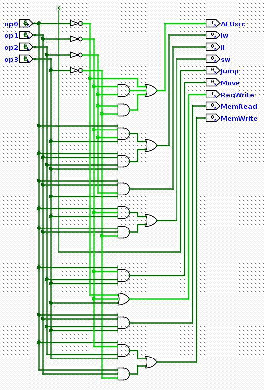
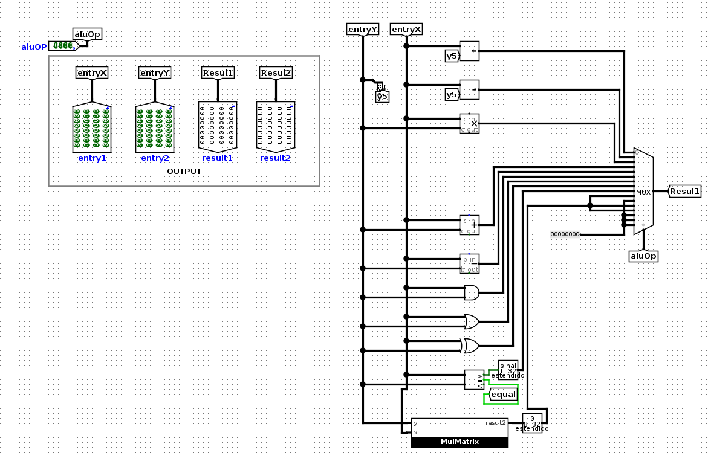

# Zazu MIPS-like processor
## ENTREGA TRABALHO DE ARQUITETURA E ORGANIZAÇÃO DE COMPUTADORES
Trabalho realizado por Thiago Nerton.
Este README fornece informações sobre a atribuição, como configurar e executar o projeto, e detalhes adicionais.

## Sumário
- [Main](#main)
- [ULA](#ULA)
- [RegCPU](#RegCPU)
- [UC](#UC)
- [Etc](#etc)
- [Contribuições](#contribuições)
- [Licença](#licença)

### Main
#### Visão Geral do Processador

Na imagem fornecida, observa-se o processador em sua totalidade, com todos os componentes visíveis. Esta imagem oferece uma visão geral dos elementos que compõem o processador.

#### Estrutura do Contandor de Endereço e Jump

A segunda imagem destaca o circuito responsável pelo controle do fluxo de instruções do processador, especificamente o contador de endereço e a lógica de salto (jump). Este circuito é crucial para iterar as instruções armazenadas na memória e para realizar desvios condicionais ou incondicionais no fluxo de execução do programa.

A terceira imagem mostra a parte do processador responsável pela manipulação de registradores e execução de operações. Esta parte recebe os códigos de operação (OPCODE) provenientes da memória e executa as ações correspondentes, como operações aritméticas, lógicas ou de transferência de dados. É onde ocorre a maior parte do processamento central do processador.
A integração dessas partes forma o processador como um todo, permitindo a execução de programas, manipulação de dados e realização de operações conforme as instruções fornecidas. A interação entre esses componentes é essencial para o funcionamento correto e eficiente do processador.

### UC

Foto do circuito responsável por interpretar os códigos de operação (OPCODEs) recebidos da memória e direcionar as operações apropriadas para os diferentes componentes do processador, como a ALU (Unidade Lógica e Aritmética), registradores, unidade de memória, entre outros. 

### ULA

Circuito responsável por realizar operações lógicas e aritméticas em dados que estão sendo processados pelo Zazu. A ULA é responsável por executar operações como Multiplicação de Matriz, adição, subtração, comparação, operações lógicas (como AND, OR, NOT) e operações de deslocamento (shift).

### Utilização

Projeto requer Logisim Evolution para ser executado.

### Etc
#### Ordem de Leitura
 - RT entry 1
 - RS entry 2
 - RD dest 
 - opcode
   V0 = Reg$3
   Escreve Um - Lê Dois
   Ordem    
   OP RD RT RS
   Manipulação de Endereço sempre por RD
#### OPCODES
  - 0000 : sll
  - 0001 : slr
  - 0010 : MUL
  - 0011 : ADD
  - 0100 : SUB
  - 0101 : AND
  - 0110 : OR
  - 0111 : XOR
  - 1000 : LES
  - 1001 : Li Turbo
  - 1010 : JMP
  - 1011 : MOVE 
  - 1100 : MulMatrix4x4
  - 1101 : LI
  - 1110 : SW
  - 1111 : LW

### Contribuições
 Thiago 100%

